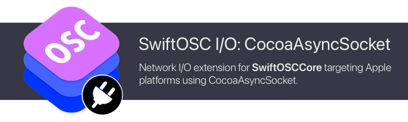

# SwiftOSC I/O: CocoaAsyncSocket

[](https://swiftpackageindex.com/orchetect/swift-osc-io-cocoa) [](https://swiftpackageindex.com/orchetect/swift-osc-io-cocoa) [](https://github.com/orchetect/swift-osc-io-cocoa/blob/main/LICENSE)

Network I/O extension for [SwiftOSCCore](https://github.com/orchetect/swift-osc-core) targeting Apple platforms using [CocoaAsyncSocket](https://github.com/robbiehanson/CocoaAsyncSocket) as a backend.

## Compatibility

| macOS | iOS  | tvOS | visionOS | watchOS | Linux | Android | WASM | Windows |
| :---: | :--: | :--: | :------: | :-----: | :---: | :-----: | :--: | :-----: |
|   🟢   |  🟢   |  🟢   |    🟢     |  -[^1]  |   -   |    -    |  -   |    -    |

[^1]: CocoaAsyncSocket does not have watchOS support.

## Getting Started

This extension is available as a Swift Package Manager (SPM) package.

To use this extension as standalone dependency (instead of importing the **swift-osc** umbrella repository):

1. Add the **swift-osc-io-cocoa** repo as a dependency.

   ```swift
   .package(url: "https://github.com/orchetect/swift-osc-io-cocoa", from: "1.0.0")
   ```

2. Add **SwiftOSCIO** to your target.

   ```swift
   .product(name: "SwiftOSCIO", package: "swift-osc-io-cocoa")
   ```

3. Import **SwiftOSCIO** to use it.

   ```swift
   import SwiftOSCIO
   ```

## Documentation

For I/O API documentation, see the [SwiftOSCCore online documentation](https://swiftpackageindex.com/orchetect/swift-osc-core/documentation/swiftosciocore) for this repository.

For example code see the main [SwiftOSC](https://github.com/orchetect/swift-osc) repository.

## Support

For support, feature requests and bug reports see the main [SwiftOSC](https://github.com/orchetect/swift-osc) repository.

## Author

Coded by a bunch of 🐹 hamsters in a trenchcoat that calls itself [@orchetect](https://github.com/orchetect).

## License

Licensed under the MIT license. See [LICENSE](LICENSE) for details.
